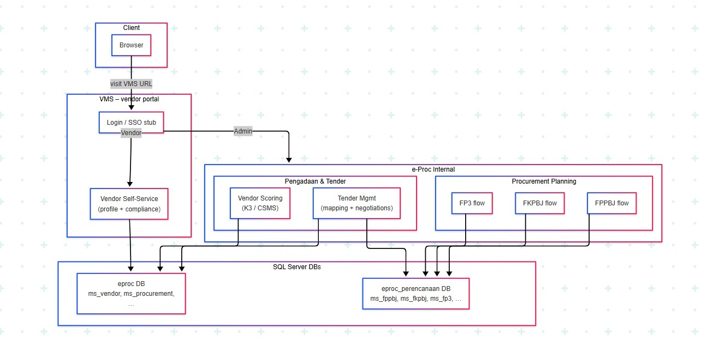

# E-Procurement System - Admin Panel

This is the administrative backend system for the Vendor Management System (VMS), designed to manage and streamline the procurement process. This system serves as the control center for managing vendors, procurement requests, and the entire procurement lifecycle.

## E-Procurement Ecosystem

This project is part of a larger E-Procurement ecosystem that consists of three main components:

1. **E-Procurement Admin Panel** (This Project)
   - Handles procurement management
   - Manages vendor approvals
   - Processes procurement requests
   - Generates reports
   - Accessible only with admin accounts

2. **E-Procurement Internal** ([eproc-internal](https://github.com/revanza-git/eproc-internal))
   - Internal procurement management
   - Department management
   - Budget management
   - Accessible only with admin accounts

3. **E-Procurement VMS** ([eproc-vms](https://github.com/revanza-git/eproc-vms))
   - Vendor registration and management
   - Document submission
   - Vendor self-service portal
   - Accessible only with vendor accounts

### System Flow



The flow diagram above illustrates how the three components interact:
- Vendors register and submit documents through VMS
- Internal system manages procurement requests and budgets
- Admin Panel processes approvals and manages the overall procurement lifecycle

## Features

### Vendor Management
- Vendor Registration and Verification
- Document Management for Vendors
- Vendor Blacklist Management
- Vendor Assessment and Rating System
- Vendor Performance Tracking

### Procurement Management
- Procurement Request Processing
- Document Management
- Automated Workflow Management
- Contract Management
- Progress Tracking

### System Administration
- User Role Management
- Department Management
- System Configuration
- Audit Trail
- Automated Notifications

### Automated Processes
- Document Expiration Checks
- Blacklist Management
- Department Notifications
- Procurement Status Updates
- Email Notifications

## Technology Stack

- **PHP 5.2.4+**: Core programming language
- **CodeIgniter Framework**: MVC framework for rapid development
- **MySQL**: Database management system
- **Apache**: Web server
- **Composer**: PHP dependency management
- **Rector**: PHP code quality tool

## Prerequisites

- PHP 5.2.4 or higher
- MySQL Database
- Apache Web Server
- Composer
- mod_rewrite enabled in Apache
- Access to E-Procurement Internal system
- Access to E-Procurement VMS system

## Installation Steps

1. **Clone the Repository**
   ```bash
   git clone [repository-url]
   cd eproc_pengadaan
   ```

2. **Install Dependencies**
   ```bash
   composer install
   ```

3. **Configure Database**
   - Create a new MySQL database
   - Import the database schema (if provided)
   - Update database configuration in `application/config/database.php`

4. **Configure Application**
   - Set base URL in `application/config/config.php`
   - Configure email settings in `application/config/email.php`
   - Update system settings
   - Configure integration settings for VMS and Internal systems

5. **Set Permissions**
   - Ensure `application/cache` and `application/logs` directories are writable
   - Set appropriate permissions for upload directories

6. **Configure Cron Jobs**
   Set up the following cron jobs:
   ```bash
   # Check expired items
   * * * * * php /path/to/cron_cek_expired.php
   
   # Process blacklist
   * * * * * php /path/to/cron_blacklist.php
   
   # Send department notifications
   * * * * * php /path/to/cron_dpt.php
   
   # Send email notifications
   * * * * * php /path/to/cron_mail.php
   ```

7. **Web Server Configuration**
   - Ensure mod_rewrite is enabled
   - Configure virtual host to point to the project directory
   - Set document root to the project's root directory

## Project Structure

```
├── application/          # Application code
│   ├── config/          # Configuration files
│   ├── controllers/     # Controller classes
│   ├── models/          # Model classes
│   ├── views/           # View files
│   ├── libraries/       # Custom libraries
│   └── helpers/         # Helper functions
├── system/              # CodeIgniter core files
├── assets/              # Static assets (CSS, JS, images)
└── vendor/              # Composer dependencies
```

## Integration with VMS and Internal Systems

This admin panel is designed to work in conjunction with both the VMS and Internal systems. The integration points include:

### VMS Integration
- Vendor data synchronization
- Document management
- Authentication and authorization
- Notification system
- Audit trail

### Internal System Integration
- Procurement request synchronization
- Budget management
- Department data synchronization
- User role management
- Workflow integration

## Security Considerations

- Implement proper access controls
- Enable HTTPS
- Regular security updates
- Secure file upload handling
- Input validation and sanitization
- SQL injection prevention
- XSS protection
- Secure API endpoints for system integration

## Support

For support and inquiries, please contact:
- Email: revanza.raytama@gmail.com
- LinkedIn: [Revanza Raytama](https://linkedin.com/in/revanzaraytama)

## License

This project is licensed under the MIT License - see the LICENSE file for details.

## Contributing

Please read CONTRIBUTING.md for details on our code of conduct and the process for submitting pull requests.

---

**Note**: This system is part of a larger E-Procurement ecosystem. Make sure to properly configure the integration points with both the VMS and Internal systems before deployment. 